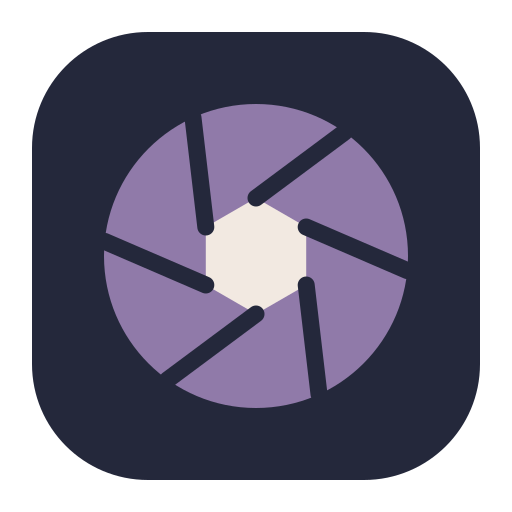

<div align="center">
  
</div>

<h1 align="center">ProDev Theme Switcher</h1>

<p align="center">
  <em>An iris: the instrument that decides how much light gets through.</em>
</p>

[](https://github.com/nilanjan/pro_dev_theme_switcher/actions/workflows/ci.yml)
[](#requirements)
[](LICENSE)
[](#tests)

macOS menu bar app that switches your whole development stack — the OS, terminal,
multiplexer, editor and Claude Code — between a light and a dark theme in one click.

Ships with **Tokyo Night Storm** (dark) and **Rosé Pine Dawn** (light). Themes are
directories on disk, so adding more needs no rebuild.

<sub>The mark is built on the one hue both shipped palettes share — the Rosé Pine
spec calls it <code>iris</code>, <code>#907aa9</code>. Six blades, seams raked
0.62&nbsp;rad off-radius so it reads as rotating rather than as a star.
<code>tools/mkicon.swift</code> regenerates the <code>.icns</code> from that same
geometry, so the icon can never drift from
<a href="Resources/logo.svg"><code>logo.svg</code></a>.</sub>

---

> ## ⚠️ READ BEFORE INSTALLING
>
> **No warranty. Use at your own risk.** Provided "AS IS" — see [LICENSE](LICENSE).
>
> **🍎 Not from Apple. Not notarized. Not on the Mac App Store.** This is signed with
> an ad-hoc signature and distributed directly by the author. Gatekeeper will warn
> you and may refuse the first launch; you must allow it manually in
> **System Settings → Privacy & Security**. Apple has not reviewed, approved or
> endorsed it.
>
> **🔒 It uses a private Apple API.** The **Auto** (sunrise/sunset) feature calls
> into the undocumented `SkyLight` framework, because macOS exposes no public API
> for that setting. Apple may break it in any update. Light and Dark use only
> public APIs — just don't use Auto if this concerns you.
>
> **📝 It overwrites other applications' config files** — Alacritty, tmux, Neovim,
> herdr and Claude Code — on **every single switch**. Edits to
> `herdr/config.toml` and `~/.claude/settings.json` are in-place `sed` and
> **cannot be undone**. **Back those files up before your first run.** Hand-edits
> inside the regions it manages will be lost.
>
> **™ Not affiliated with** Apple, Anthropic, Alacritty, tmux, Neovim, herdr,
> Microsoft or GitHub. Bundled palettes are **modified** adaptations of
> [Tokyo Night](https://github.com/folke/tokyonight.nvim) and
> [Rosé Pine](https://rosepinetheme.com) — don't report issues with them upstream.
>
> **♿ The contrast gate is a signal, not a conformance claim.** Passing it does not
> mean any theme meets WCAG or any other accessibility standard.
>
> **📖 Full terms: [DISCLAIMER.md](DISCLAIMER.md) — please read it.**

---

## User guide

### Requirements

macOS 14 or later, Apple silicon or Intel. Command Line Tools are enough to build —
no full Xcode needed. **macOS only**; there are no plans for other platforms, since
the app exists to drive the macOS appearance setting.

### Install

```sh
git clone https://github.com/nilanjan/pro_dev_theme_switcher.git
cd pro_dev_theme_switcher
make install
```

Builds the app, signs it ad-hoc, copies it to `/Applications`, installs the themes
and launches it. The icon appears in the menu bar.

**First launch:** macOS will block it because it is not notarized. Open
**System Settings → Privacy & Security**, scroll to the message about
*ProDev Theme Switcher*, and click **Open Anyway**. You will also be asked to allow
it to control **System Events** — that is how it flips the system appearance. Deny
it and everything except the macOS target still works.

### Everyday use

| Action | What happens |
|---|---|
| **Left-click** the menu bar icon | Toggle light ⇄ dark now |
| **Right-click** | Open the panel |

The icon shows the current state: ☀︎ light, ☾ dark, ◐ Auto.

### The panel

```
Light — Rosé Pine Dawn          <- current mode and theme
────────────────────────────
  ☀︎ Light                 ✓
  ☾ Dark
  ◐ Auto                        <- follow the macOS sunrise/sunset schedule
────────────────────────────
  ☀︎ Light Theme          ▸     <- pick which theme light mode uses
  ☾ Dark Theme           ▸     <- ...and dark
────────────────────────────
  macOS                   ✓     <- per-target opt-out
  Alacritty               ✓
  Neovim                  ✓
  tmux                    ✓
  herdr                   ✓
  Claude Code             ✓
  VS Code — follows macOS       <- native, never touched
────────────────────────────
  Launch at Login         ✓
  Quit ProDev Theme Switcher
```

**Light / Dark / Auto.** Auto hands control to the macOS sunrise/sunset schedule.
The app keeps syncing because it listens for the appearance notification, so your
terminals follow the schedule too. Picking Light or Dark explicitly leaves Auto,
exactly as System Settings behaves.

**Light Theme / Dark Theme.** Choose which installed theme each mode uses. Picking a
theme for the mode you are currently in applies it immediately; picking for the
other mode just records it, so nothing flashes. The choice persists.

**Per-target opt-out.** Untick a target and it is left alone on every switch —
useful when one tool is mid-task, or if you would rather it never touched a given
config file. VS Code is shown disabled because it follows the OS natively via
`window.autoDetectColorScheme`; the app never touches it.

### CLI

```sh
prodev-theme-switcher --set dark|light|auto|toggle
```

Headless. Worth binding to a hotkey — it is on `<leader>tt` in Neovim. Override the
theme for one run without changing your saved choice:

```sh
PDTS_LIGHT_THEME=some-other-theme prodev-theme-switcher --set light
PDTS_SKIP=herdr,claude prodev-theme-switcher --set dark
```

### Adding a theme

Create `config/themes/<slug>/` with these files, then `make install-config`. It
appears in the right submenu on the next right-click. Nothing is compiled in.

| File | Target |
|---|---|
| `meta` | `mode`, display `name`, and per-target ids (`nvim`, `herdr`, `accent`) |
| `alacritty.toml` | terminal palette |
| `tmux.conf` | status bar and pane borders |
| `nvim.lua` | base46 theme table |
| `herdr.toml` | the `[theme.custom]` block |
| `claude.json` | Claude Code custom theme |

`meta` exists because a slug is not always what a target calls the same theme —
`tokyo-night-storm` is `tokyonight-storm` to base46 and `tokyo-night` to herdr.

Run `python3 tests/palette_gate.py` afterwards: it will tell you which contrast rule
a new palette breaks rather than letting it through silently.

### Uninstall

```sh
make uninstall
```

Removes the app, `~/.config/prodev-theme-switcher`, and the preferences domain.
**Files it wrote into other tools' configs are left in place** — restore your own
backups if you want them back.

---

## How it works

macOS appearance is the single source of truth. The app flips it, then reacts to
`AppleInterfaceThemeChangedNotification` and runs
`~/.config/prodev-theme-switcher/sync.sh`, which applies the theme selected for that
mode. Switching from Control Center or the sunrise/sunset schedule therefore works
too.

| Target | Mechanism |
|---|---|
| macOS | AppleScript → System Events |
| Alacritty | theme file copied into the mode slot, `live_config_reload` |
| tmux | theme file copied into the mode slot, `source-file` |
| Neovim | base46 user theme + state file, `FocusGained` reload |
| herdr | `config.toml` rewrite + `server reload-config` |
| Claude Code | `~/.claude/themes/<slug>.json` + settings `theme: custom:<slug>` |
| VS Code | native `window.autoDetectColorScheme` |

`sync.sh` takes a `mkdir` mutex: the app invokes it directly *and* from its
appearance-notification observer, and overlapping runs used to corrupt herdr's TOML.

## Palette

Colours are assigned by **role**, not by palette name, and the gate enforces it.

**Surfaces.** Dawn packs surface/base/hl-low/overlay into four lightness points, all
within 7% of pure white, so the canvas read as bland white and elevation was
invisible. The canvas sits on `overlay` `#f2e9e1` and every other surface steps
*down* from it — a light theme separates surfaces by darkening; only a dark theme
lightens. Mirroring Storm's chrome literally is what painted the pane gaps and the
selected sidebar row near-white.

**Accents as text.** Every Storm accent clears 5.4:1 on its canvas; three Dawn
accents did not — gold 1.87, rose 2.37, foam 2.86. Each is walked down in HLS
lightness, hue and saturation preserved, until it clears 3.0:1
(`#bf7614` / `#cf6864` / `#53909a`).

**ANSI.** Both upstream ports ship an ANSI black invisible on their own background
(Storm `#32344a` = 1.20:1, Dawn `#f2e9e1` = 1.10:1); TUIs draw bullets and
box-drawing with ANSI 0, so those glyphs vanished. Beyond that, slots 7/15 carry the
*light* end of a light theme rather than text, so they are gated as surfaces in
light and as text in dark.

**herdr** overloads `surface_dim` for both the selected sidebar row and the tab-chip
label, so the label cannot be recoloured alone; each theme darkens the accent fill
instead until the label clears 4.5:1. Its token→surface mapping is undocumented and
was established by splitting tokens one at a time; the roles are recorded in each
theme's `herdr.toml`.

## Tests

| Command | Covers |
|---|---|
| `swift run core-tests` | 83 checks over `ThemeSwitcherCore` — **100% of lines, 100% of functions** |
| `./tests/sync_test.sh` | `sync.sh` against a throwaway `HOME`: slug resolution, per-target opt-out, unknown-theme fallback, and that the managed herdr block never accumulates |
| `python3 tests/palette_gate.py` | contrast and surface rules for every shipped theme; no app or GUI needed |
| `./check.sh` | the live machine: drives the real app through both modes and asserts every target landed, then runs the palette gate. Restores the appearance it found |

`main.swift` is deliberately **not** covered: `NSStatusItem`, AppleScript and the
SkyLight `dlsym` calls all need a window server that no CI runner has. That boundary
is why the model lives in its own target — everything that makes a decision is on
the testable side of it, and CI fails if `ThemeSwitcherCore` drops below 100%.

CI runs all four on every push and pull request, plus a smoke test that builds the
real `.app`, verifies its signature, and drives the CLI through both modes against a
scratch `HOME`.

## Build

```sh
make install         # build, sign, install app + themes, launch
make install-config  # themes only
make dmg             # dist/ProDev-Theme-Switcher-1.0.dmg
make check           # live end-to-end check
make uninstall
```

Swift 6.4's default XCBuild backend requires full Xcode, so the Makefile passes
`--build-system native`.

## License

MIT — see [LICENSE](LICENSE). Legal and usage terms: **[DISCLAIMER.md](DISCLAIMER.md)**.
