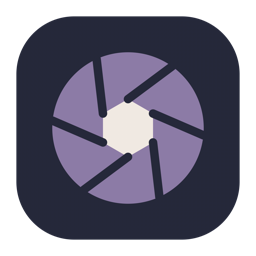
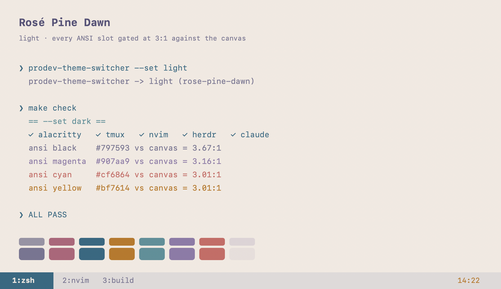
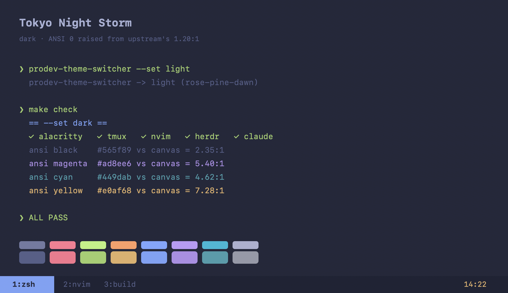

<div align="center">



# ProDev Theme Switcher

**One click. Your whole terminal stack changes theme together.**

macOS appearance, Alacritty, tmux, Neovim, herdr, Claude Code and OpenCode — light or
dark,
in step, in about a second.

[](https://github.com/nilanjan/pro_dev_theme_switcher/actions/workflows/ci.yml)
[](#requirements)
[](LICENSE)
[](#tests)

</div>

---

## The problem it solves

You move a window into the sun and your terminal is unreadable. So you change
Alacritty. Then tmux's status bar is still dark. Then Neovim. Then the thing in the
other pane. Five configs, three of which you have to look up, and you do it again at
sunset.

This is one click in the menu bar. Everything follows, including apps launched
afterwards. Set it to **Auto** and it tracks sunrise and sunset on its own.

It also fixes the themes. Both upstream palettes ship colours that are effectively
invisible on their own background — Tokyo Night's ANSI black sits at **1.20:1**,
where box-drawing and bullets simply disappear. Every colour here is checked against
its background, and CI fails if one drops below the threshold.

## What it looks like

<div align="center">
  
  
</div>

<sub>Rendered directly from the shipped theme files, contrast figures included — so
these cannot drift from what the app actually installs.</sub>

---

## Install

```sh
git clone https://github.com/nilanjan/pro_dev_theme_switcher.git
cd pro_dev_theme_switcher
make install
```

Builds, signs, installs the themes, and launches. The icon appears in your menu bar.
Command Line Tools are enough — no full Xcode. A `make dmg` build works the same way:
drag it to Applications and the app lays down its own themes on first launch.

**Before it edits anything** it shows you what it is about to touch, and why:

```
ProDev Theme Switcher will edit these files

Alacritty     ~/.config/alacritty/alacritty.toml  — adds an import; moves your own [colors] out
tmux          ~/.tmux.conf                        — adds a source-file line
Neovim        ~/.config/nvim/init.lua             — adds a require line
herdr         ~/.config/herdr/config.toml         — [theme], [ui] accent, [theme.custom]
Claude Code   ~/.claude/settings.json             — "theme"
OpenCode      ~/.config/opencode/tui.json         — "theme"

Each file is copied once, before its first edit, to
~/.config/prodev-theme-switcher/backup/original.

                                   [ Quit ]  [ Back up and continue ]
```

Only the tools it actually found are listed. **Quit** leaves every file untouched and
asks again next launch. The backup is taken once and never overwritten, so it stays
the pre-install original however many switches follow. To put everything back:

```sh
bash ~/.config/prodev-theme-switcher/sync.sh --restore
```

**On first launch** macOS blocks it, because it is not notarized. Open
**System Settings → Privacy & Security**, find the message about *ProDev Theme
Switcher*, and click **Open Anyway**. You will also be asked to allow it to control
**System Events** — that is how it flips the appearance. Decline and everything
except the macOS switch still works.

### Requirements

macOS 14+, Apple silicon or Intel. Nothing else is required: the app detects which
of the supported tools you have and only touches those. If you have none of them, it
says so on first launch rather than sitting there appearing to do nothing.

## Using it

| | |
|---|---|
| **Left-click** the icon | Toggle light ⇄ dark now |
| **Right-click** | Open the panel |

The icon is the current state: ☀︎ light, ☾ dark, ◐ Auto.

```
Light — Rosé Pine Dawn                 current mode and theme
──────────────────────────
  ☀︎ Light                 ✓
  ☾ Dark
  ◐ Auto                             follow macOS sunrise/sunset
──────────────────────────
  ☀︎ Light Theme          ▸           which theme light mode uses
  ☾ Dark Theme           ▸           …and dark
──────────────────────────
  macOS                   ✓          per-target opt-out
  Alacritty               ✓
  Neovim                  ✓
  tmux                    ✓
  herdr — not installed              detected, greyed out
  Claude Code             ✓
  OpenCode — not installed           detected, greyed out
  VS Code — follows macOS            native, never touched
──────────────────────────
  Launch at Login         ✓
  Quit
```

**Auto** hands over to the macOS sunrise/sunset schedule. The app keeps syncing
because it listens for the appearance notification, so your terminals follow the
schedule too. Choosing Light or Dark explicitly leaves Auto, exactly as System
Settings behaves.

**Light Theme / Dark Theme** pick which installed theme each mode uses. Choosing for
the mode you are currently in applies it immediately; choosing for the other mode
just records it, so nothing flashes.

**Per-target opt-out** — untick a tool and it is left alone on every switch. Useful
when something is mid-task, or if you would rather it never touched a given file.

**Only what you have.** The list is re-checked every time you open the menu.
Anything not installed is shown greyed out rather than hidden, so it is clear the
app supports it and equally clear why it is idle. Install a tool, reopen the menu,
and it is live — no restart.

### From the terminal

```sh
prodev-theme-switcher --set dark|light|auto|toggle
```

Worth binding to a hotkey — it is on `<leader>tt` in Neovim. Override for a single
run without changing your saved choice:

```sh
PDTS_LIGHT_THEME=some-theme prodev-theme-switcher --set light
PDTS_SKIP=herdr,claude      prodev-theme-switcher --set dark
```

### Adding a theme

Drop a directory into `config/themes/<slug>/` and run `make install-config`. It
appears in the right submenu on the next right-click — nothing is compiled in.

| File | Target |
|---|---|
| `meta` | `mode`, display `name`, per-target ids (`nvim`, `herdr`, `accent`) |
| `alacritty.toml` | terminal palette — self-contained, no imports |
| `tmux.conf` | status bar and pane borders |
| `nvim.lua` | base46 theme table |
| `herdr.toml` | the `[theme.custom]` block |
| `claude.json` | Claude Code custom theme |
| `opencode.json` | OpenCode custom theme |

`meta` exists because a slug is not always what a target calls the same theme:
`tokyo-night-storm` is `tokyonight-storm` to base46 and `tokyo-night` to herdr.

Then run `python3 tests/palette_gate.py` — it names the contrast rule a new palette
breaks instead of letting it through.

### Uninstall

```sh
make uninstall
```

Removes the app, its themes and the preferences domain. The edits it made to other
tools' configs stay, and so does `~/.config/prodev-theme-switcher/backup/original`.
Restoring is your call, not a side effect — `make uninstall` prints the one-line
`cp` that does it.

---

## How it works

macOS appearance is the single source of truth. The app flips it, reacts to
`AppleInterfaceThemeChangedNotification`, and runs
`~/.config/prodev-theme-switcher/sync.sh` for the theme selected for that mode. So
switching from Control Center or the sunset schedule works too.

Each target is *wired in*, not just written next to. The theme goes to a fixed file
the app owns; the user's own config gets one line pointing at it, added once, inside
a marked block, after their own settings so it wins. That is the difference between
this and the first release, which wrote theme files to paths that only the author's
dotfiles happened to read — and did nothing on anyone else's Mac.

| Target | Mechanism |
|---|---|
| macOS | AppleScript → System Events |
| Alacritty | `themes/custom/current.toml`, imported **last** from `alacritty.toml` — later imports win, and the importing file wins over all of them, so any `[colors]` tables in the main file are moved out (backed up). Live via `live_config_reload`. Needs Alacritty ≥ 0.14 |
| tmux | `~/.tmux/themes/current.conf`, `source-file`d from the end of your tmux conf; a running server is told at once |
| Neovim | state file + `lua/prodev_theme.lua`, required from the end of `init.lua`; applies the colorscheme if its plugin is installed ([tokyonight.nvim](https://github.com/folke/tokyonight.nvim), [rose-pine/neovim](https://github.com/rose-pine/neovim)), else flips `background`; re-checked on `FocusGained`. The base46 table is also installed for NvChad |
| herdr | `[theme] name` (table created if absent), `[ui] accent`, managed `[theme.custom]` block + `server reload-config` |
| Claude Code | one fixed theme file, `~/.claude/themes/prodev-theme-switcher.json`, rewritten on every switch; `settings.json` pinned once to `theme: custom:prodev-theme-switcher` (key added, or the file created, if missing). Claude Code watches that directory but reads the key only at startup, so the fixed slug is what lets a **running** session follow the switch; `/theme` shows it under the current theme's name |
| OpenCode | the same shape: one fixed theme file, `~/.config/opencode/themes/prodev-theme-switcher.json`, rewritten on every switch, with `tui.json` (or `tui.jsonc`, which OpenCode prefers) pinned once to `theme: prodev-theme-switcher`. Tokens are written as plain hex rather than `{dark, light}` variants **on purpose** — OpenCode chooses between variants by sniffing the terminal background, and the mode is already decided here |
| VS Code | native `window.autoDetectColorScheme` — untouched |

`sync.sh` takes a `mkdir` mutex: the app invokes it directly *and* from its
appearance observer, and overlapping runs used to corrupt herdr's TOML.

## Palette

Colours are assigned by **role**, not by palette name, and the gate enforces it.

**Surfaces.** Dawn packs surface/base/hl-low/overlay into four lightness points, all
within 7% of pure white — the canvas read as bland white and elevation was
invisible. The canvas now sits on `overlay` `#f2e9e1` and every other surface steps
*down* from it: a light theme separates surfaces by darkening; only a dark theme
lightens.

**Accents as text.** Every Storm accent clears 5.4:1 on its canvas. Three Dawn
accents did not — gold 1.87, rose 2.37, foam 2.86. Each is walked down in HLS
lightness, hue and saturation preserved, until it clears 3.0:1.

**ANSI.** Both upstream ports ship an ANSI black invisible on their own background
(Storm `#32344a` = 1.20:1, Dawn `#f2e9e1` = 1.10:1). Slots 7/15 carry the *light*
end of a light theme rather than text, so they are gated as surfaces in light and as
text in dark.

**herdr** reuses `surface_dim` for both the selected sidebar row and the tab-chip
label, so the label cannot be recoloured alone; each theme darkens the accent fill
until the label clears 4.5:1.

## Tests

| Command | Covers |
|---|---|
| `swift run core-tests` | 126 checks over `ThemeSwitcherCore` — **100% of lines and functions** |
| `./tests/sync_test.sh` | `sync.sh` against a throwaway `HOME` shaped like a **fresh Mac** — bare configs, none of the author's dotfile hooks: every target gets wired in exactly once, originals are backed up and `--restore` puts them back, a real `tmux` started on the edited conf shows the theme; plus slug resolution, opt-out, fallback, the herdr block never accumulating |
| `python3 tests/palette_gate.py` | contrast and surface rules for every shipped theme |
| `python3 tests/theme_json_test.py` | Claude Code and OpenCode themes parse and set **every** key the tool defines. Both loaders fail quietly: Claude Code drops an unknown key without a word and falls back to its built-in palette for one you omit, so a theme can be valid and still leak stock colours |
| `./check.sh` | the live machine, end to end; restores the appearance it found |

`main.swift` is deliberately not covered: `NSStatusItem`, AppleScript and the
SkyLight `dlsym` calls need a window server no runner has. That boundary is why the
model lives in its own target — every decision sits on the testable side, and CI
fails if it drops below 100%.

## Build

```sh
make install         # build, sign, install app + themes, launch
make install-config  # themes only
make dmg             # dist/ProDev-Theme-Switcher-1.0.dmg
make check           # live end-to-end check
make uninstall
```

---

> ### ⚠️ Before you install
>
> **No warranty. Use at your own risk** — see [LICENSE](LICENSE).
>
> **Not from Apple. Not notarized. Not on the App Store.** Ad-hoc signed and
> distributed directly by the author. Gatekeeper will warn you.
>
> **It uses a private Apple API.** *Auto* calls the undocumented `SkyLight`
> framework, because macOS exposes no public API for that setting. Apple may break
> it in any update. Light and Dark use only public APIs.
>
> **It edits other apps' config files.** Once, with your consent, it adds a line to
> `alacritty.toml` (and moves your own `[colors]` out), `.tmux.conf`, `init.lua`,
> `herdr/config.toml` and `~/.claude/settings.json`; then on every switch it rewrites
> the regions it manages. **Each file is backed up before its first edit** to
> `~/.config/prodev-theme-switcher/backup/original`, and `sync.sh --restore` puts them
> back. Hand-edits inside the managed regions are lost on the next switch.
>
> **Not affiliated with** Apple, Anthropic, Alacritty, tmux, Neovim, herdr, OpenCode,
> Microsoft or GitHub. Bundled palettes are **modified** adaptations — see
> [Credits](#credits) for full attribution and exactly what was changed.
>
> **The contrast gate is a signal, not a conformance claim.** Passing it does not
> mean any theme meets WCAG or any other accessibility standard.
>
> **Full terms: [DISCLAIMER.md](DISCLAIMER.md).**

## Credits

The two bundled themes are **adaptations** of other people's work, used with thanks
under their own licenses. The palettes below are modified — please judge these
changes on their own and don't report issues with them upstream.

### Tokyo Night — Storm

By **Folke Lemaitre** and contributors · [folke/tokyonight.nvim](https://github.com/folke/tokyonight.nvim) · MIT

Canonical Storm palette, with one change: ANSI 0 is `#565f89` (Storm's own
`comment`) instead of `#32344a`, and ANSI 8 is `#737aa2` (`dark5`). Upstream's ANSI 0
sits at 1.20:1 against the background, so box-drawing and bullets are invisible in
TUIs that use it. Every other value is untouched.

### Rosé Pine — Dawn

By the **Rosé Pine** team · [rose-pine/rose-pine-theme](https://github.com/rose-pine/rose-pine-theme) · [rosepinetheme.com](https://rosepinetheme.com) · MIT

Canonical Dawn hues, reassigned by role:

| Change | From | To | Why |
|---|---|---|---|
| Canvas | `base` `#faf4ed` | `overlay` `#f2e9e1` | `base` is 4% off pure white; surfaces had no room to separate |
| Surfaces | ascending | descending | A light theme separates by darkening, not lightening |
| gold | `#ea9d34` | `#bf7614` | 1.87:1 as text — walked down in HLS lightness, hue kept |
| rose | `#d7827e` | `#cf6864` | 2.37:1 as text |
| foam | `#56949f` | `#53909a` | 2.86:1 as text |
| ANSI 0 | `#f2e9e1` | `#797593` | 1.10:1 — invisible |
| ANSI 7/15 | text | surfaces | In a light theme these carry the light end of the ramp |

`love` `#b4637a`, `pine` `#286983` and `iris` `#907aa9` already cleared 3:1 and are
unchanged.

### Also used

- **[alacritty/alacritty-theme](https://github.com/alacritty/alacritty-theme)** (Apache-2.0) — the upstream Alacritty ports both palettes were merged from.
- **[NvChad/base46](https://github.com/NvChad/base46)**, building on **nvim-base16** by **Ashkan Kiani** (MIT) — the Neovim theme-table format `nvim.lua` targets.
- **[herdr](https://herdr.dev)**, **[Claude Code](https://claude.com/claude-code)** and **[OpenCode](https://opencode.ai)** — theme formats written against, none affiliated with nor endorsing this project.

All product names and trademarks belong to their respective owners and are used only
to describe interoperability.

## License

This project's own code is MIT — see [LICENSE](LICENSE). That covers the app, the
build and the tests; it grants no rights in any third-party trademark, and the
bundled palettes remain subject to their upstream licenses above.
